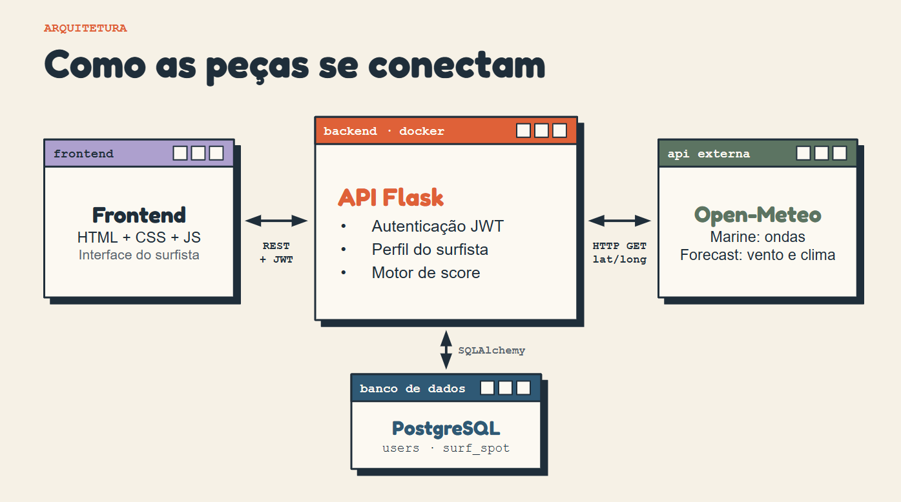

# 🌊 WaveMatch — Frontend

O **WaveMatch** é uma aplicação web desenvolvida para ajudar surfistas a encontrar condições de surf compatíveis com seu nível de experiência e suas preferências pessoais.

Este repositório contém o **frontend da aplicação**, responsável pela interface visual e pela comunicação com a API REST do WaveMatch.

## 🛠️ Tecnologias utilizadas

- **HTML5:** estrutura das páginas.
- **CSS3:** estilização e identidade visual.
- **JavaScript:** interatividade e comunicação com a API.
- **Fetch API:** realização de requisições HTTP.
- **Docker:** conteinerização da aplicação.
- **Nginx:** servidor web utilizado para disponibilizar o frontend.

## ✨ Funcionalidades

A interface do WaveMatch permite:

- Cadastrar novos usuários.
- Realizar login.
- Informar o nível de experiência no surf.
- Definir preferências de altura mínima e máxima das ondas.
- Consultar recomendações personalizadas.
- Visualizar informações retornadas pelo backend.

As informações são processadas pelo backend, que consulta os dados externos e gera as recomendações.

## 🏗️ Arquitetura

O WaveMatch utiliza uma arquitetura cliente-servidor, com frontend e backend organizados em repositórios independentes.

O frontend é responsável por:

1. Apresentar a interface da aplicação.
2. Receber os dados inseridos pelos usuários.
3. Enviar requisições HTTP para o backend.
4. Gerenciar a interação do usuário com a aplicação.
5. Exibir as informações e recomendações retornadas pela API.

O diagrama abaixo apresenta a arquitetura do WaveMatch
e a comunicação entre seus componentes.



### Comunicação entre os componentes

| Componente | Responsabilidade |
|---|---|
| Frontend | Interface e interação com o usuário |
| Backend Flask | API REST e regras de negócio |
| PostgreSQL | Persistência dos dados |
| Open-Meteo | Dados meteorológicos e marítimos |

O frontend não acessa diretamente o PostgreSQL nem a API externa. Essas operações são realizadas pelo backend.

## 🔗 Integração com a API

O frontend utiliza JavaScript e a Fetch API para realizar requisições HTTP ao backend.

Entre as operações disponibilizadas pela API estão:

| Método | Endpoint | Descrição |
|---|---|---|
| POST | `/register` | Cadastro de usuários |
| POST | `/login` | Autenticação |
| GET | `/user_main_dashboard` | Consulta de recomendações |

A comunicação com endpoints protegidos utiliza tokens JWT obtidos durante a autenticação.

O backend deve estar em execução para que as funcionalidades dependentes da API funcionem corretamente.

## 🚀 Executando com Docker

### Pré-requisitos

- Docker Desktop instalado.
- Backend do WaveMatch configurado e em execução.

### 1. Clone o repositório

```bash
git clone URL_DO_REPOSITORIO_FRONTEND
cd NOME_DO_REPOSITORIO
```

Substitua os valores pelos dados do seu repositório.

### 2. Construa a imagem Docker

No terminal, dentro da pasta do frontend:

```bash
docker build -t wavematch-frontend .
```

### 3. Execute o container

```bash
docker run --name wavematch-web -p 8080:80 wavematch-frontend
```

### 4. Acesse a aplicação

Abra o navegador:

http://localhost:8080

O frontend será disponibilizado pelo Nginx.

## ⚙️ Configuração do backend

Durante a execução local, o backend deve estar disponível em:

http://localhost:5000

O JavaScript do frontend deve utilizar o endereço correto da API para enviar suas requisições.

**Importante:** o frontend e o backend são executados em containers independentes.

O backend deve permitir as requisições provenientes do frontend por meio da configuração adequada de CORS.

## 🐳 Docker

O projeto utiliza uma imagem baseada no Nginx para disponibilizar os arquivos estáticos da aplicação.

Exemplo do Dockerfile:

```dockerfile
FROM nginx:alpine

COPY . /usr/share/nginx/html

EXPOSE 80
```

O Nginx disponibiliza os arquivos HTML, CSS e JavaScript pela porta 80 do container, mapeada para a porta 8080 do computador.

## 📚 Contexto acadêmico

O WaveMatch foi desenvolvido como projeto acadêmico, com o objetivo de aplicar conhecimentos relacionados a:

- Desenvolvimento de interfaces web.
- Integração entre frontend e backend.
- Comunicação com APIs REST.
- Manipulação de dados com JavaScript.
- Autenticação de usuários.
- Conteinerização de aplicações.
